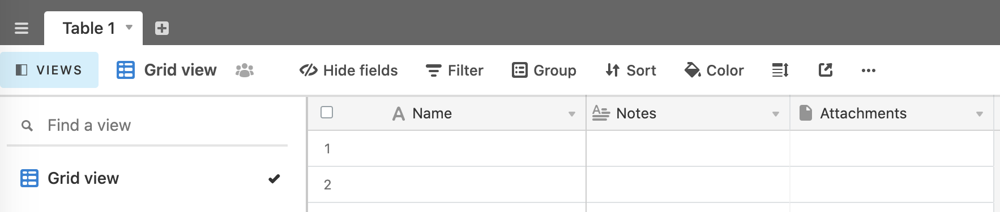

# Development: Airtable Setup

You should already have an [Airtable](https://airtable.com) account, as detailed in the [Prerequisites](development.md#prerequisites).

Now we need to set up a base and table to store events and event reports.

1. Log into Airtable. The dashboard defaults to the Bases view.
2. Click the `+` icon to `Add a base`.
3. In the dropdown, choose **Start from scratch**.
4. Name your base whatever you want (it's the _table_ name that will become significant for our Speakerbot app, which we'll add in a minute). You can also select a color and an icon for your base. A base is a _collection_ of tables.
5. Once your base is set up, click on it to open it. You will see an empty table in grid view. Your view should look something like this:

6. Rename "Table 1" to a name of your choosing. This will be the table where Speakerbot saves and reads data.